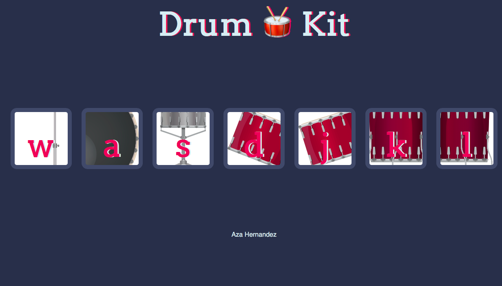

# **Play the drums**
### Adding event listeners to buttons and using the DOM
### Each Drum has a different sound, just click on them
#### The Way that this works is that we’ve got a number of keys that represent different drums in a typical drum set and when you click on any of these buttons then you’ll get the corresponding sound of the drum, and in addition you can also use the keys on the Keyboard

